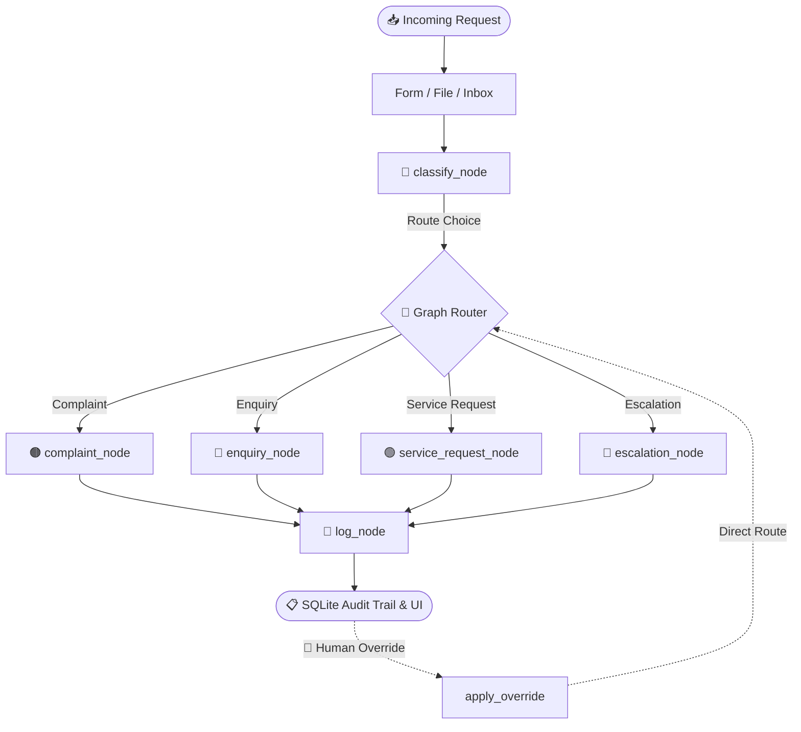

# 🔄 Incoming Request Processing Workflow (POC)

An enterprise-grade, AI-driven automation workflow for customer support, service request fulfillment, and escalations. Powered by **LangGraph** for orchestration, **Qwen-3 (235B)** hosted on **Nebius AI** for classification and drafting, and **Streamlit** for a premium operations dashboard.

---

## 🌟 Executive Overview
This Proof of Concept (POC) automates the sorting, routing, auditing, and drafting of replies for incoming customer communications. Traditional keyword-based routing fails when communications are emotionally charged or contain multi-layered requests. By utilizing LLM-based contextual classification coupled with stateful graph routing, this workflow processes tickets deterministically through custom remediation pathways, while leaving a full audit trail and providing a **Human-in-the-Loop (HITL) override** dashboard.

---

## 🏗️ Architecture & Core Components



### 1. The Stateful Graph (`graph/graph.py` & `graph/state.py`)
At the core of the application is a compiled LangGraph state machine. The state of each ticket is managed via `TicketState` (a subclass of `TypedDict` containing all inputs, classification parameters, branch outputs, and logging fields).
- **Nodes**: Logical execution blocks (`classify_node`, `complaint_node`, etc.).
- **Edges**: Directed linkages. A conditional router reads the classification result from state and dynamically routes the execution to the correct branch.

### 2. The Language Model Layer (`graph/nodes.py`)
We leverage **Qwen3-235B-A22B-Instruct** (hosted via Nebius AI) using the OpenAI-compatible `langchain-openai` SDK. 
- **JSON Binding**: Node queries bind structured schemas using `llm.bind(response_format={"type": "json_object"})` to ensure the output is structured and parses correctly.
- **Reliability Fallback**: If the API encounters a timeout or JSON parsing error, the system catches the exception and routes the ticket to **Escalation / High** with a detailed error log in the reasoning field, preventing workflow failure.

### 3. SQLite Audit Trail (`cases.db`)
Every ticket processed is permanently written to a local database. The database is initialized automatically at runtime:

| Column Name | Type | Description |
|---|---|---|
| `case_id` | `TEXT` (Primary Key) | Formatted unique ID (e.g. `CASE-8A2F9B1E`). |
| `timestamp` | `TEXT` | ISO-8601 string of request ingestion time. |
| `input_source` | `TEXT` | `form`, `file_upload`, or `simulated_inbox`. |
| `classification` | `TEXT` | `Complaint`, `Enquiry`, `Service Request`, or `Escalation`. |
| `urgency` | `TEXT` | `Low`, `Medium`, `High`, `Critical`. |
| `reasoning` | `TEXT` | Detailed AI reasoning or human override notes. |
| `status` | `TEXT` | `open`, `resolved`, `escalated`, `pending_human`. |
| `route_to` | `TEXT` | Assigned team or individual handler. |
| `response_draft` | `TEXT` | Auto-generated email/notification reply. |
| `sla_timer_hours` | `INTEGER` | Target response deadline (Service Requests). |
| `followup_hours` | `INTEGER` | Escalation follow-up warning time (Complaints). |
| `human_review_flag` | `INTEGER` (0/1) | Flag indicating if a human agent must review the case. |
| `auto_resolution_paused` | `INTEGER` (0/1) | Prevents background automation systems from closing ticket. |
| `actions_taken` | `TEXT` (JSON) | Audit list representing the sequential operations checklist. |
| `raw_input` | `TEXT` | The original raw body content. |
| `is_human_override` | `INTEGER` (0/1) | Identifies if the case parameters were changed by an operator. |

---

## 🔀 Remediation Matrix & Expected Outputs

| Request Type | Default Urgency | Branch Remediation Steps | Expected Outputs |
|:---|:---|:---|:---|
| **Complaint** | High | 1. Empathic acknowledgement draft.<br>2. Escalate assignment (e.g., Team Lead).<br>3. Log case with priority flags.<br>4. Set 2-hour follow-up reminder. | Escalation routing + draft response + 2h follow-up warning tag. |
| **General Enquiry** | Low | 1. Classify query sub-topic.<br>2. Query Knowledge Base context.<br>3. Generate standard draft reply.<br>4. Log case status directly as **resolved**. | Direct draft response + "resolved" status badge in dashboard. |
| **Service Request** | Medium | 1. Extract required details (names, accounts, tools).<br>2. Route to specialized team (e.g. IT Support).<br>3. Generate request confirmation draft.<br>4. Set SLA timer based on urgency. | Specialized routing assignment + structured SLA timer (2h/4h/8h/24h). |
| **Escalation / Urgent** | Critical | 1. Immediately flag ticket for human review (`human_review_flag = True`).<br>2. Draft urgent, high-care acknowledgement response.<br>3. Trigger supervisor alert notification.<br>4. Pause auto-resolution pipelines. | Red alert banner + "pending_human" status + auto-resolution paused flag. |

---

## 👤 Human-in-the-Loop (HITL) Override

To prevent "AI locks" where a misclassification traps a ticket in the wrong queue, the POC implements a robust **Human-in-the-Loop Override** system:

1. **Default defaults**: The UI selectboxes dynamically read and pre-select the AI's classification and urgency to prevent manual error when adjusting settings.
2. **LangGraph Bypass (`apply_override`)**: Passing an override directly to a running graph can cause state threading locks. The UI instead invokes a custom transactional bypass. This queries the correct branch node directly and triggers an **UPSERT (SQL UPDATE)** on the existing row matching the `case_id`.
3. **Database Audit**: The `is_human_override` flag changes from `0` to `1`. In the dashboard, the decision column flags the case as `👤 Human Override` instead of `🤖 AI`, maintaining an audit trail of operator corrections.

---

## 🖥️ Streamlit Interface Design

The frontend consists of a polished, dark-blue glassmorphic UI divided into two spaces:

### Tab 1: Process Request
- **Ingestion Modes**: Support for manual **Form Input**, **File Upload** (`.txt` or `.eml`), and a **Simulated Inbox** containing four pre-loaded validation scenarios.
- **Visual Trace**: Real-time `st.status` widget updating with exact execution sub-steps.
- **Case Card**: Displays status badges (matching classification brand colors), reasoning explanations, remediation checklists, and an email draft box with a single-click download button.
- **Override Section**: A collapsible human-in-the-loop console to select alternative parameters and re-process the current ticket inline.

### Tab 2: Case Dashboard
- **KPI Metrics**: Total cases, Resolved, Open, Escalated, and Pending Human counts.
- **Interactive Log Table**: Displays a searchable list of SQLite cases. Clicking any row in the table dynamically expands the full detail card below the table (complete with actions taken and draft downloads).
- **Visual Analytics**: Interactive bar chart displaying real-time metrics of ticket volume by type.

---

## 🛠️ Installation & Execution

### Prerequisites
- Python 3.12+
- `uv` package manager (highly recommended for performance)

### 1. Set environment variables
Ensure your Nebius API Key is present in your shell session:
```bash
export NEBIUS_API_KEY="your-api-key-here"
```

### 2. Install dependencies
```bash
uv pip install -e .
```

### 3. Run test assertions
Run the backend test script to verify graph orchestration, routing pathways, and LLM functionality:
```bash
python3 -m graph.graph
```

### 4. Launch the dashboard
Start the Streamlit application:
```bash
streamlit run UI/app.py
```
Open `http://localhost:8501` in your browser.

---

## ⚡ Technical Challenges & Solutions

### 1. Non-deterministic JSON schemas from the LLM
- **Problem**: When classifying or extracting entities, raw text LLM responses often returned conversational preambles or malformed JSON keys.
- **Solution**: Bound a strict JSON schema using LangChain's structural output capability and set `temperature=0.1` to force Qwen-3 to match keys deterministically.

### 2. Multi-rendering download button crashes in Streamlit
- **Problem**: When a user selected a case in the log table, the UI rendered a detail card with `st.download_button`. If the same case or same button layout was rendered in multiple tabs/views simultaneously, Streamlit crashed with a `StreamlitDuplicateElementId` exception.
- **Solution**: Generated unique key signatures dynamically using `key=f"dl_{case_id}_{uuid.uuid4().hex[:8]}"` for each download button instantiation.

### 3. Human overrides creating duplicate case counts
- **Problem**: Re-running the LangGraph flow during an override caused the final node (`log_node`) to generate a new case ID, creating duplicate records for a single original email.
- **Solution**: Structured a dedicated `apply_override` pipeline that routes the data manually to the branch handler and executes an SQL `UPDATE` statement targeting the pre-existing `case_id`, preserving counts and historical data.